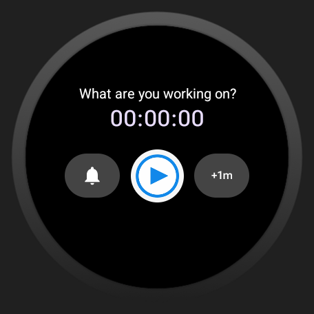

# MIT BWSI CRE[AT]E Project Team 179 - Concordians
## WearOS Watch App Overview
This watch app was created in collaboration with ...

The purpose of the watch app is to help people with ADHD focus on one task at a time.
It's main features are a focus timer with an editable text field for which the time can be chosen in hours, minutes, and seconds and that uses haptic vibrations and sound to alert the user it has ended,
a button that adds a minute to the timer, and a Do not Disturb button to turn off watch notifications (this feature may not be fully functional on all devices yet).





## Installation Instructions
The app is not yet published to Google Play Store, so it must be downloaded and then sideloaded onto the watch.

### 1. Clone the repo
```bash
git clone https://github.com/Danchaper/BWSI_Create_Challenge_Team_179__Concordians_Watch_App.git
cd BWSI_Create_Challenge_Team_179__Concordians_Watch_App```
### 2. Open in Android Studio
Open the project in Android Studio and let Gradle sync finish.

### 3. Build the APK
Go to **Build → Build Bundle(s) / APK(s) → Build APK(s)**

The APK will be generated at:
app/build/outputs/apk/debug/app-debug.apk

### 4. Sideload to your watch
Follow the [sideloading instructions](#sideloading-the-apk-to-your-wear-os-watch) below.

## Sideloading the APK to Your Wear OS Watch

### Prerequisites
- ADB (Android Debug Bridge) — bundled with Android Studio, or install via [platform-tools](https://developer.android.com/tools/releases/platform-tools)
- Developer options enabled on your watch (see below)

---

### Step 1 — Enable Developer Options on the Watch

1. Go to **Settings → System → About**
2. Tap **Build number** 7 times until you see *"You are now a developer"*
3. Go back to **Settings → Developer options**
4. Enable **ADB debugging**
5. Enable **Debug over Wi-Fi**

---

### Step 2 — Connect via ADB

**Option A: Wi-Fi**
1. On the watch, go to **Developer options → Debug over Wi-Fi**
2. Note the IP address shown (e.g., `192.168.1.42:5555`)
3. Run (substituting with your own IP):
```bash
adb connect 192.168.1.42:5555
```

**Option B: Wireless Pairing (Wear OS 3+ / Android 11+)**
1. Go to **Developer options → Wireless debugging → Pair device with pairing code**
2. Note the pairing address and 6-digit code
3. Run:
```bash
adb pair <ip>:<pairing-port>
# Enter the 6-digit code when prompted

adb connect <ip>:<connection-port>
```

---

### Step 3 — Install the APK

```bash
adb -s <device-id> install app/build/outputs/apk/debug/app-debug.apk
```

To reinstall over an existing version:
```bash
adb install -r app/build/outputs/apk/debug/app-debug.apk
```

---

### Step 4 — Launch the App

```bash
adb shell monkey -p com.example.bwsicreatechallenge179_watchapp.wear -c android.intent.category.LAUNCHER 1
```

Or find the app manually in the watch's app list.

---

### Troubleshooting

| Problem | Fix |
|---|---|
| `adb: device unauthorized` | Accept the RSA key prompt on the watch |
| `INSTALL_FAILED_UPDATE_INCOMPATIBLE` | Uninstall first: `adb uninstall com.example.bwsicreatechallenge179_watchapp.wear` |
| Watch not appearing in `adb devices` | Ensure both devices are on the same Wi-Fi network |
| Connection drops | Re-run `adb connect <ip>:<port>` — Wi-Fi ADB disconnects on sleep |

---
